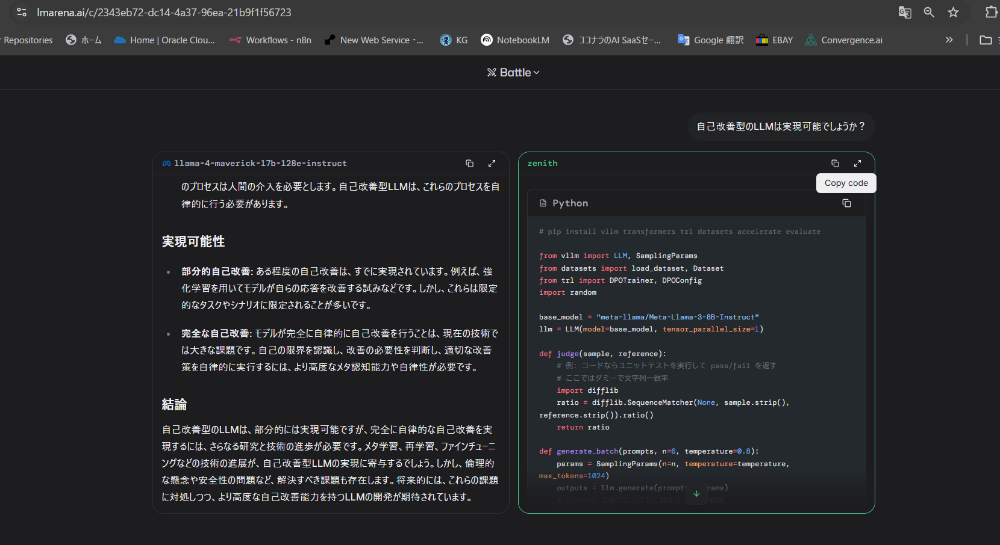

# Zenith Prompt Style Reproduction (Local CPU)

This repository demonstrates a successful local reproduction of the distinctive prompt/response style recently observed in *Zenith*, using only open-access tools and the [Phi-2 model](https://huggingface.co/microsoft/phi-2).

## ✨ What's Special?
I hit Zenith in the LM Arena. I modified the GPU-specific code for CPU and made it open



This project replicates the rare dual-format output style:

=== BEST ===
Q: What is the capital of France?
A: Paris

=== WORST ===
Q: What is the capital of France?
A: Paris


This `BEST`/`WORST` side-by-side evaluation pattern was originally presented by a top-tier AI system. To our knowledge, this is the **first** open-source replication of that style, using only a CPU-based local setup.

## 🔧 How to Run

You need Python 3.10+ and the following packages:

```bash
pip install transformers
Then run the script:


python zenithZcpu.py
This will load Phi-2 and output BEST/WORST answer comparisons in Zenith-style.

📁 Files
zenithZcpu.py — Main script to generate Zenith-style output

sample_output.txt — Sample result from local run

requirements.txt — (Optional) for environment setup

💡 Why This Matters
This isn't just a curiosity — it's a symbolic moment:

An amateur, without any GPU, has re-created the rhythm of one of the world’s most advanced LLMs.

If Zenith represents a mountain peak of AI reasoning, this repo shows we can echo its silhouette with just a laptop and passion.

☕ Support My Exploration
If you found this interesting or inspiring, you can support me here:
👉 https://buymeacoffee.com/KGNINJA

#Zenith #LLM #PromptEngineering #KGNINJA #FirstContact

# Zenith Output from LM arena
概観
- 可能か？→ 部分的にはすでに実現済み。完全自律の「無限自己改良（RSI）」は未解だが、限定領域での自動改良ループは実用段階。
- 近未来像→ 人間の監督を残しつつ、合成データ生成・自己評価・自動微調整・安全ゲーティングを回す「半自律の継続学習パイプライン」が標準化していくはず。
- 最大のボトルネック→ 信頼できる報酬/評価の設計、モデル出力への過適合、データ崩壊（model collapse）、安全性評価のスケール、計算資源。

自己改善のタイプ（何を「自己改善」と呼ぶか）
1) 推論時の自己改善（重みは変えない）
   - チェーン・オブ・ソート（CoT）、自己一致投票（self-consistency）、自己検証（self-verification）、Reflexion、ReAct、ツール使用、外部メモリ。
   - 効果：一回の質問に対し、より良い答えを探索・検証して選ぶ。重みは固定だが実効性能は上がる。

2) 自動学習ループによる改良（重みを更新）
   - 代表：RLHF/RLAIF、DPO/RRHF、自己生成データでのSFT、自己対戦（self-play）、合成ラベルでの学習、アクティブラーニング。
   - 効果：モデルが自分または他モデル・規則で採点→良い出力を蒐集→微調整→再サンプリング…という閉ループ。
   - 数学・コードなど「自動採点できる領域」で特に強力。既に大幅な性能改善が報告されている手法群です。

3) 構造的自己改善（アーキテクチャ/ツールチェーンの自動探索）
   - NAS/ハイパーパラメータ探索、MoEの門番学習、蒸留・合成教師、データセットキュレーションの自動化。
   - LLMが自分の訓練レシピやプロンプト、テスト、データ収集ポリシーを提案し、人間/自動評価で採択していく形。

現状できること（実証済みの柱）
- 自己生成データでの学習
  - Self-Instruct（LLMが指示データを作る）、Toolformer（自分でツール呼び出しラベルを付ける）など。
- AIフィードバック（RLAIF）/ 憲法AI（Constitutional AI）
  - 人間の原則集を使い、AI自身に好ましさを評価させて学習。人手を大幅に節約。
- 直接嗜好最適化（DPO）/ その周辺
  - 報酬モデルを作らず、好ましい出力を直接学習。自動評価と相性がよい。
- 自己検証・自己採点
  - 合成ルーブリック、形式検証、ユニットテスト、シミュレータ採点でスコア化し、自動フィルタ→微調整。
- 自己対戦・自動レッドチーム
  - 別モデルや自己分身が難問/攻撃を生成→本体が防御/解答→採点→学習。
- エージェント的反復（Voyager など）
  - 目標→試行→評価→スキルのライブラリ化→次タスクへ、の反復で長期的に能力を伸ばす。

難しい点・リスク
- 評価の信頼性
  - 自動採点が偏ると、望ましくない方へ強く適応（報酬ハッキング）。人間評価での定期校正が重要。
- データ崩壊・真実性の劣化
  - 自分の出力を再学習すると、多様性と事実性が徐々に損なわれる危険。人間データ・高品質外部コーパスの混入、重複除去、再重み付けが必須。
- 破滅的忘却
  - 継続学習で旧スキルが劣化する。リプレイバッファ、混合タスクでの再訓練、正則化が必要。
- 安全性とガバナンス
  - 自己改善は能力リスクを加速する。多層の安全フィルタ、能力ゲーティング、レッドチーム、分離サンドボックス、監査ログが必要。
- コスト
  - 生成→採点→微調整→評価の全工程は高価。プログラム的採点や小型教師の活用でコスト最適化が鍵。

実装ブループリント（実務向け）
1. タスク選定と採点器の設計
   - 自動採点が可能な領域から始める（コード: ユニットテスト、数学: 検証器、知識: オープンブックでファクトチェック）。
   - 安全評価器（有害性、PII漏えい、プロンプトインジェクション検出）を別途用意。

2. 生成・スコアリング
   - 多様サンプリング（温度・n-best）→ ルーブリック/テスト/ツールでスコア→ 上位を「良例」、下位を「悪例」に振り分け。
   - 不確実性推定（合議制、ジャッジモデルのアンサンブル、スコア分散での信頼度）。

3. 最適化
   - SFT（良例のみ）での自己学習 → DPO/RRHFで選好学習 → 必要に応じてRLHF/RLAIF。
   - 制約付き最適化（違反時にペナルティ）。安全性データで同時学習。

4. 評価とゲーティング
   - ホールドアウト・ベンチ（MMLU, GSM8K, HumanEval, HELM/LM Harness）＋ 独自回帰テスト。
   - オフラインで勝ったときだけデプロイへ蒸留。過学習検出のためのシャッフル・A/Bテスト。

5. 継続運用
   - Active Learning: 評価が割れるケースを優先収集し、人手で少量アノテーションしてベイズ的に校正。
   - データ衛生: 重複除去、品質スコア、出所トラッキング（データカード）。
   - ロールバック可能なモデルレジストリと監査ログ。

ミニマルな自己改良プロトタイプ（コード断片）
```python
# pip install vllm transformers trl datasets accelerate evaluate

from vllm import LLM, SamplingParams
from datasets import load_dataset, Dataset
from trl import DPOTrainer, DPOConfig
import random

base_model = "meta-llama/Meta-Llama-3-8B-Instruct"
llm = LLM(model=base_model, tensor_parallel_size=1)

def judge(sample, reference):
    # 例: コードならユニットテストを実行して pass/fail を返す
    # ここではダミーで文字列一致率
    import difflib
    ratio = difflib.SequenceMatcher(None, sample.strip(), reference.strip()).ratio()
    return ratio

def generate_batch(prompts, n=6, temperature=0.8):
    params = SamplingParams(n=n, temperature=temperature, max_tokens=1024)
    outputs = llm.generate(prompts, params)
    # outputs は各プロンプトに対する n 個の候補
    grouped = []
    for out in outputs:
        grouped.append([o.text for o in out.outputs])
    return grouped

# データ読み込み（例: GSM8K サブセット）
data = load_dataset("gsm8k", "main", split="train[:100]")

pairs = []
for ex in data:
    prompt = ex["question"]
    refs = ex["answer"]
    cand_groups = generate_batch([prompt])[0]
    scored = [(c, judge(c, refs)) for c in cand_groups]
    scored.sort(key=lambda x: x[1], reverse=True)
    if scored[0][1] < 0.5:
        continue  # 自動採点が低いものは学習に使わない
    # DPO 用に「勝ち/負け」ペアを作る
    win, lose = scored[0][0], scored[-1][0]
    pairs.append({"prompt": prompt, "chosen": win, "rejected": lose})

train_ds = Dataset.from_list(pairs)

# DPO で自己改善
cfg = DPOConfig(
    output_dir="dpo-self-improve",
    per_device_train_batch_size=2,
    gradient_accumulation_steps=8,
    learning_rate=1e-6,
    num_train_epochs=1,
    beta=0.1,
)

trainer = DPOTrainer(
    model=base_model,
    ref_model=base_model,  # 参照モデルに元モデルを使う
    args=cfg,
    train_dataset=train_ds,
)

trainer.train()
trainer.save_model("self-improved-llm")
```
概観
- 可能か？→ 部分的にはすでに実現済み。完全自律の「無限自己改良（RSI）」は未解だが、限定領域での自動改良ループは実用段階。
- 近未来像→ 人間の監督を残しつつ、合成データ生成・自己評価・自動微調整・安全ゲーティングを回す「半自律の継続学習パイプライン」が標準化していくはず。
- 最大のボトルネック→ 信頼できる報酬/評価の設計、モデル出力への過適合、データ崩壊（model collapse）、安全性評価のスケール、計算資源。

自己改善のタイプ（何を「自己改善」と呼ぶか）
1) 推論時の自己改善（重みは変えない）
   - チェーン・オブ・ソート（CoT）、自己一致投票（self-consistency）、自己検証（self-verification）、Reflexion、ReAct、ツール使用、外部メモリ。
   - 効果：一回の質問に対し、より良い答えを探索・検証して選ぶ。重みは固定だが実効性能は上がる。

2) 自動学習ループによる改良（重みを更新）
   - 代表：RLHF/RLAIF、DPO/RRHF、自己生成データでのSFT、自己対戦（self-play）、合成ラベルでの学習、アクティブラーニング。
   - 効果：モデルが自分または他モデル・規則で採点→良い出力を蒐集→微調整→再サンプリング…という閉ループ。
   - 数学・コードなど「自動採点できる領域」で特に強力。既に大幅な性能改善が報告されている手法群です。

3) 構造的自己改善（アーキテクチャ/ツールチェーンの自動探索）
   - NAS/ハイパーパラメータ探索、MoEの門番学習、蒸留・合成教師、データセットキュレーションの自動化。
   - LLMが自分の訓練レシピやプロンプト、テスト、データ収集ポリシーを提案し、人間/自動評価で採択していく形。

現状できること（実証済みの柱）
- 自己生成データでの学習
  - Self-Instruct（LLMが指示データを作る）、Toolformer（自分でツール呼び出しラベルを付ける）など。
- AIフィードバック（RLAIF）/ 憲法AI（Constitutional AI）
  - 人間の原則集を使い、AI自身に好ましさを評価させて学習。人手を大幅に節約。
- 直接嗜好最適化（DPO）/ その周辺
  - 報酬モデルを作らず、好ましい出力を直接学習。自動評価と相性がよい。
- 自己検証・自己採点
  - 合成ルーブリック、形式検証、ユニットテスト、シミュレータ採点でスコア化し、自動フィルタ→微調整。
- 自己対戦・自動レッドチーム
  - 別モデルや自己分身が難問/攻撃を生成→本体が防御/解答→採点→学習。
- エージェント的反復（Voyager など）
  - 目標→試行→評価→スキルのライブラリ化→次タスクへ、の反復で長期的に能力を伸ばす。

難しい点・リスク
- 評価の信頼性
  - 自動採点が偏ると、望ましくない方へ強く適応（報酬ハッキング）。人間評価での定期校正が重要。
- データ崩壊・真実性の劣化
  - 自分の出力を再学習すると、多様性と事実性が徐々に損なわれる危険。人間データ・高品質外部コーパスの混入、重複除去、再重み付けが必須。
- 破滅的忘却
  - 継続学習で旧スキルが劣化する。リプレイバッファ、混合タスクでの再訓練、正則化が必要。
- 安全性とガバナンス
  - 自己改善は能力リスクを加速する。多層の安全フィルタ、能力ゲーティング、レッドチーム、分離サンドボックス、監査ログが必要。
- コスト
  - 生成→採点→微調整→評価の全工程は高価。プログラム的採点や小型教師の活用でコスト最適化が鍵。

実装ブループリント（実務向け）
1. タスク選定と採点器の設計
   - 自動採点が可能な領域から始める（コード: ユニットテスト、数学: 検証器、知識: オープンブックでファクトチェック）。
   - 安全評価器（有害性、PII漏えい、プロンプトインジェクション検出）を別途用意。

2. 生成・スコアリング
   - 多様サンプリング（温度・n-best）→ ルーブリック/テスト/ツールでスコア→ 上位を「良例」、下位を「悪例」に振り分け。
   - 不確実性推定（合議制、ジャッジモデルのアンサンブル、スコア分散での信頼度）。

3. 最適化
   - SFT（良例のみ）での自己学習 → DPO/RRHFで選好学習 → 必要に応じてRLHF/RLAIF。
   - 制約付き最適化（違反時にペナルティ）。安全性データで同時学習。

4. 評価とゲーティング
   - ホールドアウト・ベンチ（MMLU, GSM8K, HumanEval, HELM/LM Harness）＋ 独自回帰テスト。
   - オフラインで勝ったときだけデプロイへ蒸留。過学習検出のためのシャッフル・A/Bテスト。

5. 継続運用
   - Active Learning: 評価が割れるケースを優先収集し、人手で少量アノテーションしてベイズ的に校正。
   - データ衛生: 重複除去、品質スコア、出所トラッキング（データカード）。
   - ロールバック可能なモデルレジストリと監査ログ。

ミニマルな自己改良プロトタイプ（コード断片）
```python
# pip install vllm transformers trl datasets accelerate evaluate

from vllm import LLM, SamplingParams
from datasets import load_dataset, Dataset
from trl import DPOTrainer, DPOConfig
import random

base_model = "meta-llama/Meta-Llama-3-8B-Instruct"
llm = LLM(model=base_model, tensor_parallel_size=1)

def judge(sample, reference):
    # 例: コードならユニットテストを実行して pass/fail を返す
    # ここではダミーで文字列一致率
    import difflib
    ratio = difflib.SequenceMatcher(None, sample.strip(), reference.strip()).ratio()
    return ratio

def generate_batch(prompts, n=6, temperature=0.8):
    params = SamplingParams(n=n, temperature=temperature, max_tokens=1024)
    outputs = llm.generate(prompts, params)
    # outputs は各プロンプトに対する n 個の候補
    grouped = []
    for out in outputs:
        grouped.append([o.text for o in out.outputs])
    return grouped

# データ読み込み（例: GSM8K サブセット）
data = load_dataset("gsm8k", "main", split="train[:100]")

pairs = []
for ex in data:
    prompt = ex["question"]
    refs = ex["answer"]
    cand_groups = generate_batch([prompt])[0]
    scored = [(c, judge(c, refs)) for c in cand_groups]
    scored.sort(key=lambda x: x[1], reverse=True)
    if scored[0][1] < 0.5:
        continue  # 自動採点が低いものは学習に使わない
    # DPO 用に「勝ち/負け」ペアを作る
    win, lose = scored[0][0], scored[-1][0]
    pairs.append({"prompt": prompt, "chosen": win, "rejected": lose})

train_ds = Dataset.from_list(pairs)

# DPO で自己改善
cfg = DPOConfig(
    output_dir="dpo-self-improve",
    per_device_train_batch_size=2,
    gradient_accumulation_steps=8,
    learning_rate=1e-6,
    num_train_epochs=1,
    beta=0.1,
)

trainer = DPOTrainer(
    model=base_model,
    ref_model=base_model,  # 参照モデルに元モデルを使う
    args=cfg,
    train_dataset=train_ds,
)

trainer.train()
trainer.save_model("self-improved-llm")
```

この最小例では:
- モデルが自分で多数案を出す → 簡易ジャッジで勝敗付け → DPO で「勝ち」を好むように更新。
- 実務では、judge をユニットテスト/数学検証/ルーブリック＋ジャッジモデルの合議制に置き換え、安全フィルタを通します。

安全性・品質を担保するための実務ヒント
- 二段階スコアリング: まずプログラム的採点（客観）、次にジャッジモデルで文体・根拠性・安全性を総合評価。
- 人手による定期校正: 月次でサンプルを抜き取り、人間評価と自動評価のズレを推定・補正。
- リプレイバッファ: 高品質な人間データ・外部データを一定比率で混ぜ、モデル出力依存を抑える。
- 逆方向のテスト: 能力が上がるほど、脱法的方略（プロンプトインジェクション回避失敗など）を検出する赤チームを強化。
- シャドーモード運用: 本番投入前にオンライン・テレメトリで drift を監視し、異常時は即ロールバック。

将来見通し
- 2–3年スパン: 自動評価器・ツールチェーンが高度化し、ドメイン限定ではほぼ自律的なパイプラインが一般化。人間は評価器の設計とガバナンスに注力。
- 5年超: 汎用タスクでも「自己生成→自己採点→自己更新→自己監査」が統合。とはいえ、安全・法的・社会的制約から完全自律は依然ゲーティングされる可能性が高い。
- 真のRSI（爆発的自己改善）: 未知。計算資源・データ・評価・安全ゲートという外部ボトルネックに依存し、現実には「人間が設定するスロットル付きの自己改良」が主流になりそうです。

いくつかの関連研究・キーワード
- Self-Instruct, Toolformer, Reflexion, ReAct, Self-Consistency
- RLHF（Ouyang et al. 2022）、Constitutional AI / RLAIF（Anthropic 2022）
- DPO（Rafailov et al. 2023）、RRHF
- Adversarial training / Debate / IDA（Amplification）
- Voyager（自己改善エージェント）、AutoPrompt / Prompt optimization、NAS

どのレベルの「自己改善」を目指していますか？
- 対象領域: コーディング/数学/対話/検索支援/特定業務（法務・医療など）
- 自動化度: 人手ゼロで回したい？ それともゲーティング必須？
- 計算資源とモデル規模: 単一GPUで回す軽量ループか、大規模分散か
- 安全・法規制要件: 監査ログ、PII保護、モデルカードの必要性

要件が分かれば、より具体的な設計案と技術スタックをご提案します。💡

この最小例では:
- モデルが自分で多数案を出す → 簡易ジャッジで勝敗付け → DPO で「勝ち」を好むように更新。
- 実務では、judge をユニットテスト/数学検証/ルーブリック＋ジャッジモデルの合議制に置き換え、安全フィルタを通します。

安全性・品質を担保するための実務ヒント
- 二段階スコアリング: まずプログラム的採点（客観）、次にジャッジモデルで文体・根拠性・安全性を総合評価。
- 人手による定期校正: 月次でサンプルを抜き取り、人間評価と自動評価のズレを推定・補正。
- リプレイバッファ: 高品質な人間データ・外部データを一定比率で混ぜ、モデル出力依存を抑える。
- 逆方向のテスト: 能力が上がるほど、脱法的方略（プロンプトインジェクション回避失敗など）を検出する赤チームを強化。
- シャドーモード運用: 本番投入前にオンライン・テレメトリで drift を監視し、異常時は即ロールバック。

将来見通し
- 2–3年スパン: 自動評価器・ツールチェーンが高度化し、ドメイン限定ではほぼ自律的なパイプラインが一般化。人間は評価器の設計とガバナンスに注力。
- 5年超: 汎用タスクでも「自己生成→自己採点→自己更新→自己監査」が統合。とはいえ、安全・法的・社会的制約から完全自律は依然ゲーティングされる可能性が高い。
- 真のRSI（爆発的自己改善）: 未知。計算資源・データ・評価・安全ゲートという外部ボトルネックに依存し、現実には「人間が設定するスロットル付きの自己改良」が主流になりそうです。

いくつかの関連研究・キーワード
- Self-Instruct, Toolformer, Reflexion, ReAct, Self-Consistency
- RLHF（Ouyang et al. 2022）、Constitutional AI / RLAIF（Anthropic 2022）
- DPO（Rafailov et al. 2023）、RRHF
- Adversarial training / Debate / IDA（Amplification）
- Voyager（自己改善エージェント）、AutoPrompt / Prompt optimization、NAS

どのレベルの「自己改善」を目指していますか？
- 対象領域: コーディング/数学/対話/検索支援/特定業務（法務・医療など）
- 自動化度: 人手ゼロで回したい？ それともゲーティング必須？
- 計算資源とモデル規模: 単一GPUで回す軽量ループか、大規模分散か
- 安全・法規制要件: 監査ログ、PII保護、モデルカードの必要性

要件が分かれば、より具体的な設計案と技術スタックをご提案します。💡

